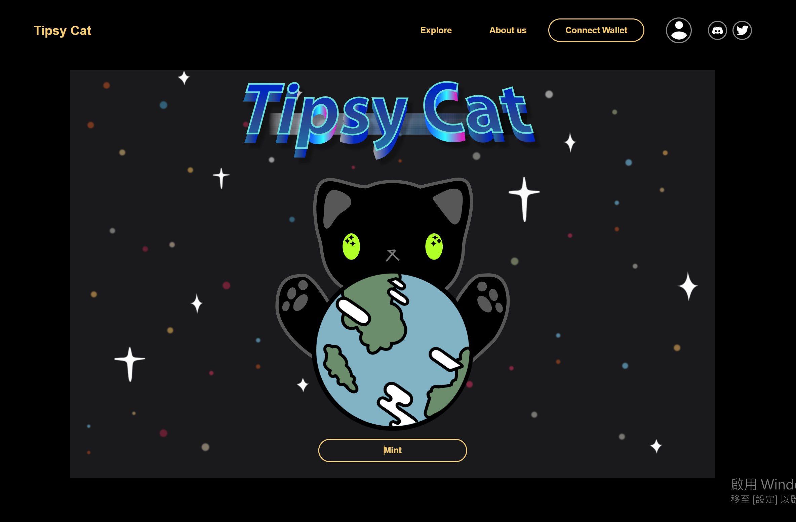

# BarNFT

## Getting Start

    git clone https://github.com/a88759666/BarNft.git

    npm install

    npm run dev

## Deployment

前往 [https://a88759666.github.io/BarNFT](https://a88759666.github.io/BarNft/)

## Intro

1. Web3作品，在Z學院的專案，但沒有串智能合約，可連結錢包
2. 主要是發行門票型的NFT，不同NFT可以合成出新的NFT

## 開發環境

  * React Vite
  * Typescript
  * Tailwind樣式開發

This project was bootstrapped with [Create React App](https://github.com/facebook/create-react-app).
